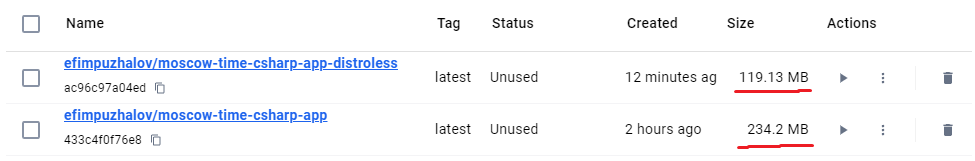

# Docker Implementation Details

## Best Practices Applied

### 1. **Multi-Stage Builds**  

- **Build Stage**: Used `mcr.microsoft.com/dotnet/sdk:6.0` to compile the app.  
- **Runtime Stage**: Used lightweight `mcr.microsoft.com/dotnet/aspnet:8.0` for production.
  - The runtime image is smaller (~200MB vs. SDK’s ~1GB) and contains only what’s needed to run the app.  

### 2. **Non-Root User**  

- Created a dedicated user `appuser` to avoid running as root.  
- Set ownership of `/app` to `appuser`.  

### 3. **Layer Optimization**  

- Copied `.csproj` first to cache dependency restoration.  
- Separated `dotnet restore` and `dotnet publish` for efficient layer caching.  

### 4. **Security**  

- Added `.dockerignore` to exclude build artifacts and sensitive files.  

### 5. **Explicit Versioning**  

- Pinned .NET SDK and runtime to version `8.0`.  

---

## How to Build and Run

```bash
# Build the image
docker build -t dockerhub-username/moscow-time-csharp-app:latest .

# Run the container
docker run -p 8080:80 dockerhub-username/moscow-time-csharp-app:latest

#You can use mine:
docker run -p 8080:80 efimpuzhalov/moscow-time-csharp-app:latest
```

Access the app at `http://localhost:8080`.

## Distroless Implementation

This image uses Microsoft's official .NET Distroless base image with:

- Minimal set of packages required for .NET applications
- Non-root user by default
- No package manager
- No shell

Official Documentation:  
[.NET Distroless Images Documentation](https://github.com/dotnet/dotnet-docker/blob/main/documentation/distroless.md)

### Distroless Image Comparison

### Key Differences

| **Aspect**          | **Original Image**               | **Distroless Image**                     |
|----------------------|-----------------------------------|-------------------------------------------|
| Base Image           | `mcr.microsoft.com/dotnet/aspnet:8.0` | `mcr.microsoft.com/dotnet/aspnet:8.0-noble-chiseled` |
| Size (approx)        | ~240 MB                          | ~120 MB                                   |
| Shell                | Yes (bash)                       | No                                        |
| Package Managers     | Yes (apt, dpkg)                  | No                                        |
| Non-Root User        | Explicitly created               | Pre-configured (UID 65532)               |
| Attack Surface       | Larger (OS packages included)    | Minimal (only runtime dependencies)      |

### Why Distroless?

1. **Smaller Size**: Removes unnecessary OS packages and tools.  
2. **Reduced Attack Surface**: No shell, package managers, or non-essential binaries.  
3. **Strict Non-Root Execution**: Pre-configured non-root user with immutable permissions.  
4. **Reproducibility**: Minimalist design reduces dependency drift.  

### Image Size Comparison

 *Example screenshot*
